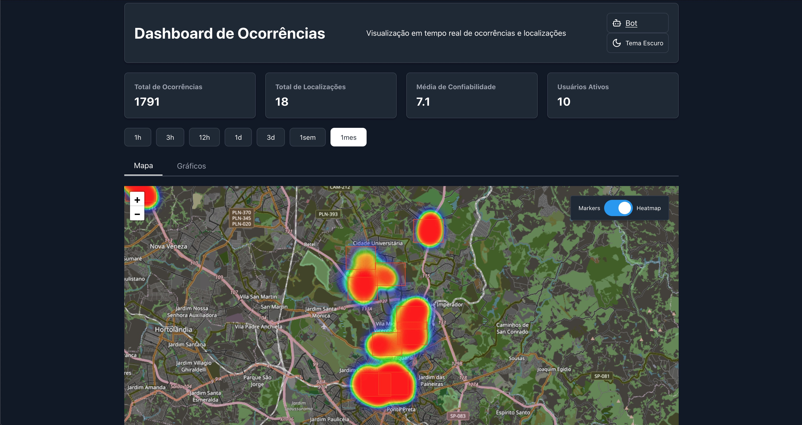
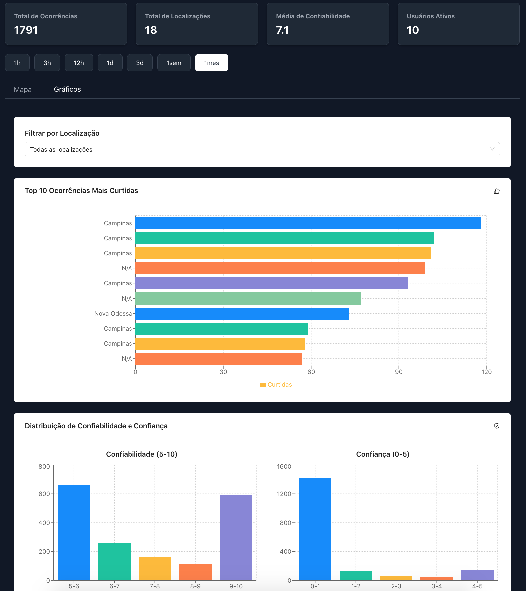
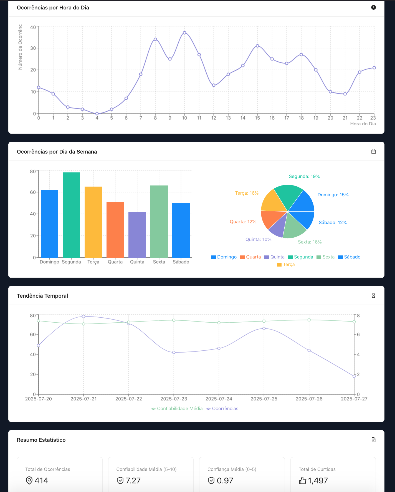

# 🌍 Geo Dashboard

O **Geo Dashboard** é uma aplicação React que fornece uma visualização em tempo real de ocorrências e localizações, utilizando mapas interativos, gráficos analíticos e integração com APIs para exibir dados dinâmicos.

## ✨ Funcionalidades

- 🗺️ **Mapa Interativo**: Visualize ocorrências em um mapa com suporte a heatmap e marcadores.
- 📊 **Gráficos Analíticos**: Inclui gráficos de barras, linhas e pizza para análise de dados.
- 🌗 **Tema Escuro/Claro**: Alternância entre temas com persistência no localStorage.
- 🎛️ **Filtros Dinâmicos**: Filtre dados por intervalo de tempo e localizações específicas.
- 📋 **Dashboard Resumo**: Exibe KPIs como total de ocorrências, confiabilidade média e mais.

## 🛠️ Tecnologias Utilizadas

- **Frontend**:
  - ⚛️ React com Vite
  - 🗺️ React-Leaflet para mapas interativos
  - 📈 Recharts para gráficos
  - 🖌️ Ant Design para componentes de UI
- **Backend**:
  - 🚀 Express.js para servir a aplicação e APIs
  - 🌐 Axios para requisições HTTP
- **Outras**:
  - 🛡️ TypeScript para tipagem estática
  - 🔑 dotenv para gerenciamento de variáveis de ambiente

## 🖼️ Imagens do Projeto

**🗺️ Mapa Interativo**

**📋 Dashboard Principal**

**📊 Gráficos Analíticos**

## 📜 Licença
Este projeto está licenciado sob a MIT License.

**Desenvolvido com 💖 por HeitorLM**